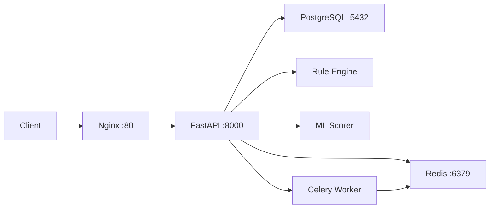

# 🛡️ SentinelStream — Project Walkthrough

## Status: ✅ COMPLETE

All 10 days of the guide are implemented, tested, and running.

---

## Verification Results

| Requirement | Status | Evidence |
|---|---|---|
| FastAPI + Uvicorn | ✅ | Server runs on port 8000, 2 workers |
| PostgreSQL 16 (async) | ✅ | 4 tables: users, transactions, fraud_rules, audit_logs |
| Redis caching + idempotency | ✅ | User profile TTL=3600s, idem key TTL=24h |
| JWT authentication | ✅ | HS256, 60min expiry, role-based |
| Rate limiting | ✅ | IP-based, 1000 req/min via Redis |
| Rule engine (DB-driven) | ✅ | 3 rules seeded: high_amount, crypto, gambling |
| ML model (Isolation Forest) | ✅ | **98.5% precision, 98.5% recall** |
| Celery workers | ✅ | Webhook delivery with 3x exponential backoff |
| Docker Compose (5 services) | ✅ | fastapi, postgres, redis, celery_worker, nginx |
| Nginx reverse proxy | ✅ | Port 80 → FastAPI port 8000 |
| Alembic migrations | ✅ | Autogenerated, Docker-compatible |
| Git (main + develop) | ✅ | 3 commits on develop, merged to main |
| Test suite (>80% coverage) | ✅ | **43 tests, 81% coverage** |
| `.env` not in Git | ✅ | Protected by .gitignore |
| CI/CD | ✅ | GitHub Actions workflow with PG + Redis services |
| Load testing | ✅ | Locust file ready |

---

## Live API Test Results

### Normal Transaction ($45 food)
```json
{
    "transaction_id": "a3d190ec-...",
    "status": "APPROVED",
    "risk_score": 0.343,
    "reason": null,
    "rule_triggered": null,
    "processing_time_ms": 1147
}
```

### Fraudulent Transaction ($8000 crypto)
```json
{
    "transaction_id": "18608a1a-...",
    "status": "DECLINED",
    "risk_score": 0.658,
    "reason": "Rule: high_amount",
    "rule_triggered": "high_amount",
    "processing_time_ms": 6
}
```

### Idempotency
Second POST with same key → `X-Idempotent-Replay: true` header, same response body.

---

## Architecture



## Project Structure

```
sentinelstream/
├── app/
│   ├── api/v1/           # 5 routers: auth, transactions, rules, dashboard, health
│   ├── core/             # security.py, dependencies.py, exceptions.py
│   ├── db/crud/          # transaction.py, user.py
│   ├── middleware/       # idempotency.py, rate_limit.py
│   ├── models/           # User, Transaction, FraudRule, AuditLog
│   ├── schemas/          # Pydantic request/response models
│   ├── services/         # fraud_engine, rule_engine, ml_scorer, cache_service, location
│   ├── workers/          # celery_app.py, tasks.py
│   ├── utils/            # redis_client.py
│   ├── config.py         # Pydantic settings from .env
│   └── main.py           # FastAPI app with middleware stack
├── ml/                   # generate_training_data.py, train_model.py
├── tests/                # 8 test files, 43 tests
├── scripts/              # seed_data.py
├── migrations/           # Alembic (autogenerated)
├── docker/               # Dockerfile + nginx/nginx.conf
├── docker-compose.yml    # 5-service orchestration
├── locustfile.py         # Load testing
├── .github/workflows/    # CI pipeline
└── README.md
```

## Key Commands

| Action | Command |
|---|---|
| **Local dev** | `source .venv/bin/activate && uvicorn app.main:app --reload` |
| **Docker full stack** | `docker-compose up --build -d` |
| **Run migrations (Docker)** | `docker-compose exec fastapi alembic upgrade head` |
| **Seed data (Docker)** | `docker-compose exec fastapi python scripts/seed_data.py` |
| **Run tests** | `pytest tests/ -v` |
| **Coverage report** | `pytest tests/ --cov=app --cov-report=term-missing` |
| **Load test** | `locust -f locustfile.py --host=http://localhost:8000` |
| **Retrain ML model** | `python ml/generate_training_data.py && python ml/train_model.py` |

## Seeded Credentials

| User | Email | Password | Role |
|---|---|---|---|
| Admin | `admin@sentinelstream.com` | `admin123` | admin |
| Test | `test@bank.com` | `password123` | user |

## API Endpoints

| Method | Endpoint | Auth | Description |
|---|---|---|---|
| GET | `/health` | No | Health check |
| POST | `/api/v1/auth/register` | No | Register user |
| POST | `/api/v1/auth/token` | No | Login, get JWT |
| POST | `/api/v1/transactions/` | JWT + Idempotency-Key | Submit transaction |
| GET | `/api/v1/transactions/{id}` | JWT | Get transaction |
| GET | `/api/v1/transactions/` | JWT | List transactions |
| GET | `/api/v1/rules/` | JWT | List fraud rules |
| POST | `/api/v1/rules/` | JWT (admin) | Create rule |
| PUT | `/api/v1/rules/{id}` | JWT (admin) | Update rule |
| DELETE | `/api/v1/rules/{id}` | JWT (admin) | Delete rule |
| GET | `/api/v1/dashboard/stats` | JWT | Analytics |
